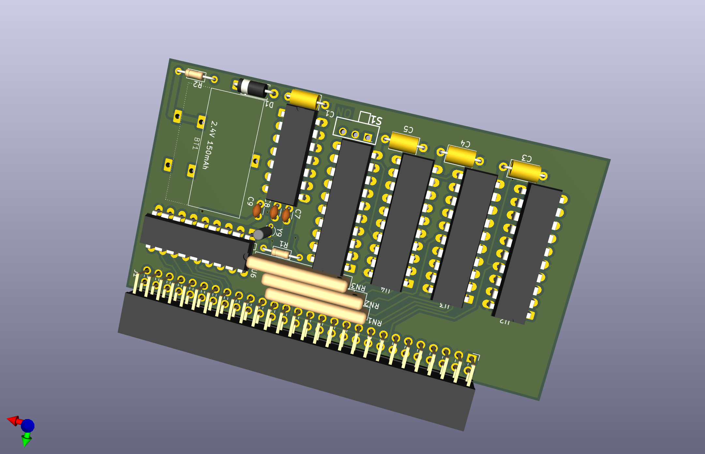
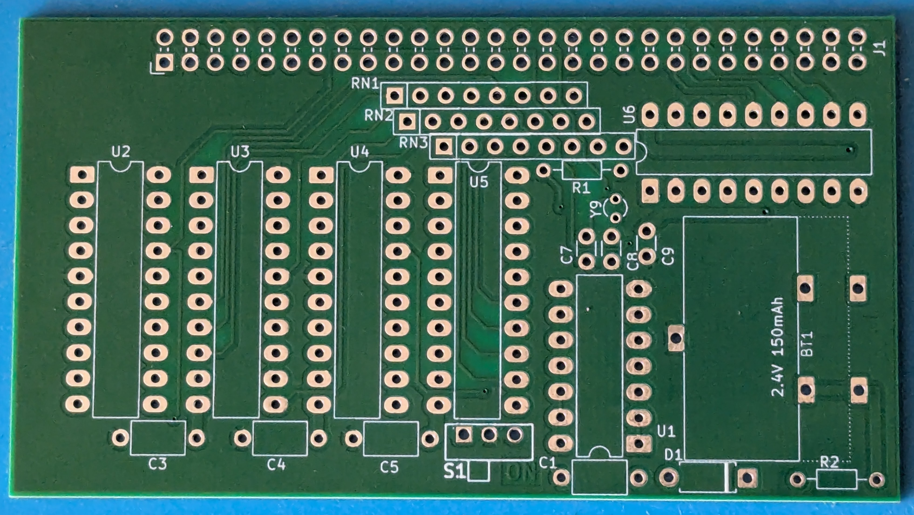
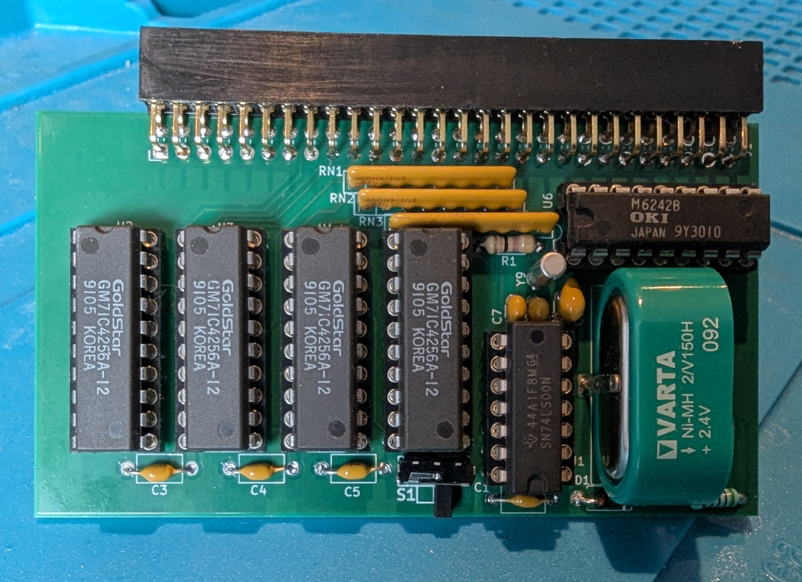
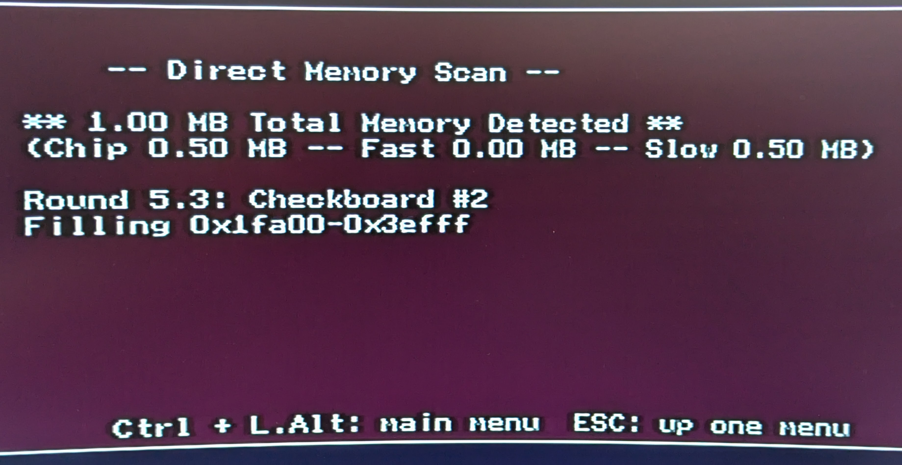
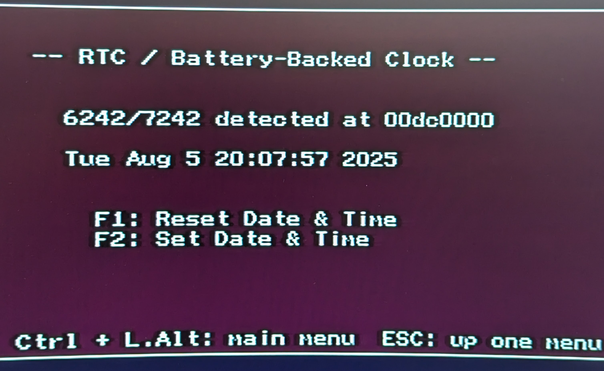
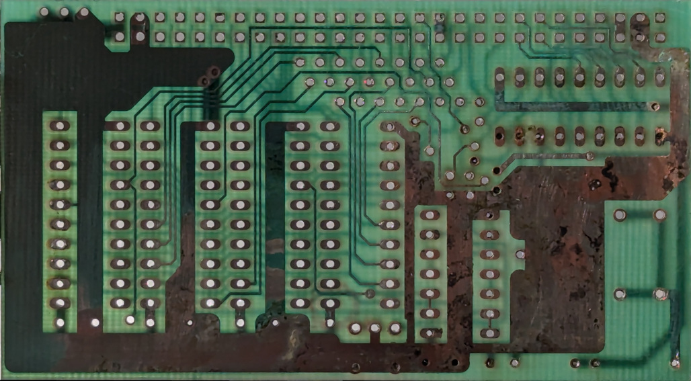
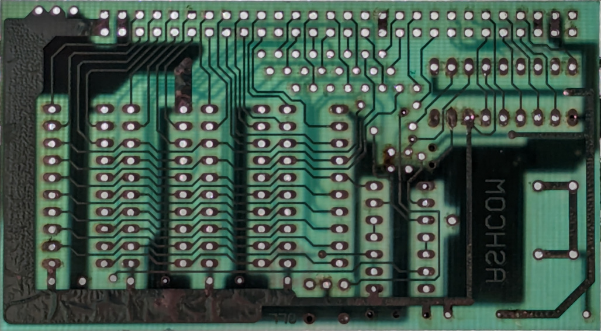

# Amiga_Ashcom_512Kb
Reproduction of the PCB for an Ashcom 512kb memory expansion, for Amiga 500s.   This was done as a learning exercise, after finding an Ashcom board with battery damage.  Rather than bodge the damaged board, I decided to replace the board.  Of course it would have been quicker and cheaper to buy a more modern equivalent, but where's the fun in that?

## Reproduction
The KiCad files (schematic and pcb) are available here.   Note the schematic and pcb were drawn separately.  I started with the intention of just re-creating the PCB, but then decided to create the schematic for completeness.  If there are any design issues with the expansion, then the issues will persist in this reproduction.  Along the same lines, neither I have replaced the battery with a CR2032.

## KiCAD Version 
KiCAD version 9.0.3.   The schematic and PCB are contained in the schematic.   The schematic was reversed manually from the PCB, so could contain errors.   The PCB should be considered the golden source.

## Oddities
The dsign seems a somewhat more basic (and cheaper) design that the official A501 expansion.  Perhaps related to this, a few curiousousities were found:-
1) Pin 5 of the memory chips are documented as Not Connected.   Yet the PCB connects these pins to GND.
2) Pin 34 and Pin 33 on the connector are shorted.   Using Raemixx500 as a reference, these pins seem to be ~CLKCS and GND.  On an Amiga 501 the signal is sent to the RTC ~CS0 input, on the Ashcom it is grounded.  Another cost saving decision?
3) The RTC clock circuit has only fix capacitors (the A501 has a fixed and variable capacitor with the crystal).
4) The holes for C9 are present on the original PCB, but not populated.  As there are no component markings, Ive assumed this was intended for a capacitor across VDD and GND (on the RTC IC), but the manufacturer obviously didnt feel this capacitor was necessary
5) There are no decoupling capacitors across VCC and GND for U2 and U6.  Either the manufacturer didn't think decoupling capacitors were needed for U2 and U5, or it's another cost saving decision.

In summary this seems a stripped down design when compared to the A501.  Does this have any nagative implications?

## Gerbers and PCB Production
Gerber files were successfully produced by PCBWAY.   After building the board was tested in an Amiga 500 (1.3 workbench) with no issues.

Using Amiga Test Kit, the memory and RTC tested successfully:-

 -  

## BOM

| Id | Designator | Footprint | Quantity | Designation Supplier | ref |
| --- | --- | --- | --- | --- | --- |
|1|C7,C8|C_Disc_D3.0mm_W1.6mm_P2.50mm|2|22pF|
|2|BT1|Varta_2.4v_150mAh|1|2.4V 150mAh|
|3|Y9|Crystal_C26-LF_D2.1mm_L6.5mm_Vertical|1|32768Hz|
|4|C1,C3,C4,C5,C9|C_Axial_L5.1mm_D3.1mm_P7.50mm_Horizontal|5|100nF|
|5|RN1,RN3,RN2|R_Array_SIP8|3|22ohm|
|6|D1|D_A-405_P7.62mm_Horizontal|1|1N914|			
|7|U1|DIP-14_W7.62mm_LongPads|1|74LS00N|	
|8|S1|780565|1|SPDT Switch, Right Angle, 2.54mm pitch, Enable/Disable|
|9|U2,U3,U4,U5|DIP-20_W7.62mm_LongPads|4|DRAM 256Kx4-bit DIP20|
|10|J1|PinSocket_2x28_P2.54mm_Horizontal|1|Female trap door connector 2x28 2.54mm Right Angled|
|11|U6|DIP-18_W7.62mm_LongPads|1|M6242B RTC|
|12|R1|R_Axial_DIN0204_L3.6mm_D1.6mm_P7.62mm_Horizontal|1|47ohm|
|13|R2|R_Axial_DIN0204_L3.6mm_D1.6mm_P7.62mm_Horizontal|1|510ohm|

The PCB seems designed for a 2.4V or a 3.6V NiMh rechargeable battery.  R2 is sized to trickle charge a 2.4v cell at around 4mA.   R2 should be changed accordingly if a 3.6v cell is used.  By my calcs that would be around 200ohms, but I have not tested this configuration.

The RTC components can be left out, and the board will then just function as a memory expansion (C7, C8, C9, Y9, BT1, D1, R2, U6, C9 can be omitted).

## References
1) https://github.com/SukkoPera/Raemixx500 
2) https://amigawiki.org/dnl/schematics/A500_R6.pdf

## Damaged PCB Pictures
The following pictures show the original PCBs, and were used to recreate the PCB layout.

